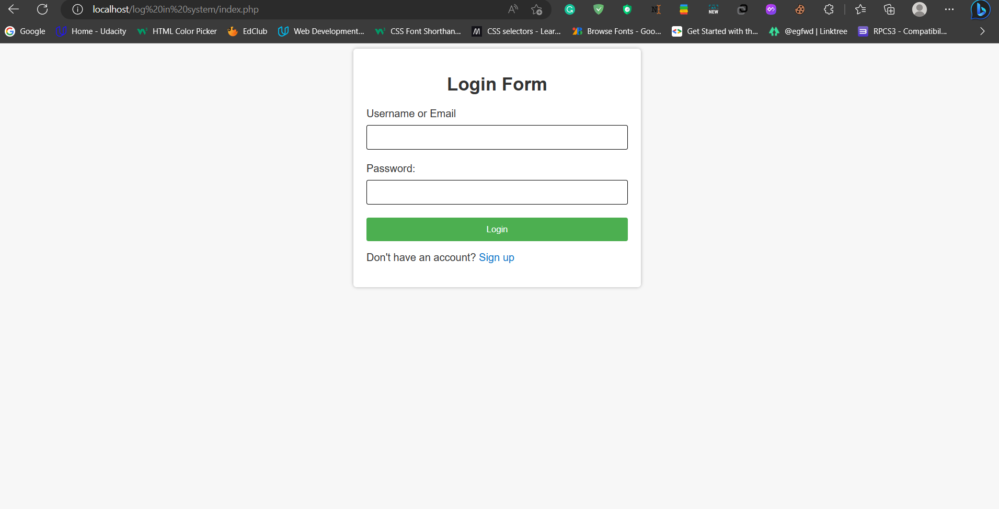
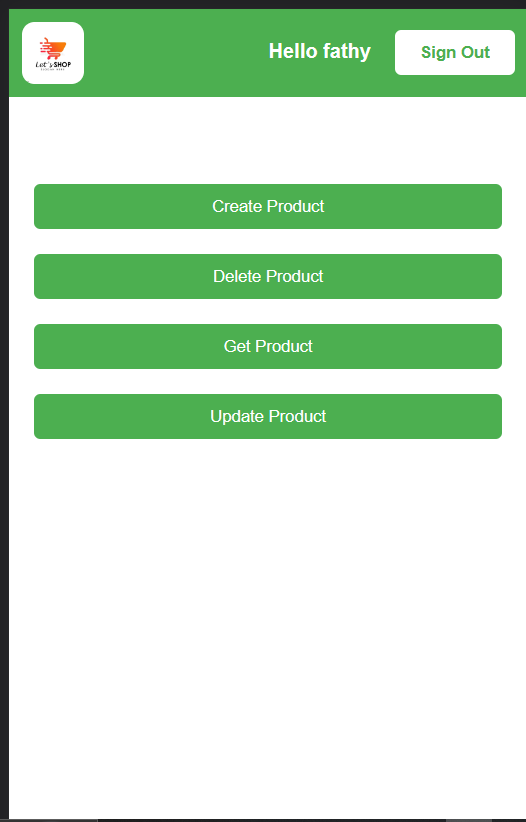

# Login System

this project is made as project task for
IEEE-Backend Zagazig-studentbranch

## Description

This is a login system created using PHP, HTML, CSS, some JavaScript, and PostgreSQL. It includes features for creating a new account, logging in, and accessing a product control system. The project has simple responsive design suitable for all screens .

## ScreenShots

## File Structure

The file structure of the login system is as follows:

-   LOG IN SYSTEM
    -   classes
        -   dbh.class.php
        -   login.class.php
        -   logincontroller.class.php
        -   product.class.php
        -   productcontroller.class.php
        -   signup.class.php
        -   signupcontroller.class.php
    -   css
        -   productHandlling.css
        -   style.css
        -   syles.app.css
    -   includes
        -   autoloader.inc.php
        -   create.inc.php
        -   delete.inc.php
        -   get.inc.php
        -   login.inc.php
        -   signup.inc.php
        -   update.inc.php
    -   sql
        -   db.sql
    -   app.php
    -   createProduct.php
    -   deleteProduct.php
    -   getProduct.php
    -   index.php
    -   logout.php
    -   signup.php
    -   updateProduct.php

## Security

The login system includes several security measures to protect user information:

-   User passwords are hashed before being stored in the database.
-   The username must be unique for each user.
-   The system uses an OOP with MVC model to ensure secure and organized code.
-   The code is regularly reviewed and updated to address any security vulnerabilities.

## Getting Started

### Dependencies

-   Describe any prerequisites, libraries, OS version, etc., needed before installing program.
-   ex. Windows 10

### Installing

To install the login system, follow these steps:

1. Clone the project repository to your local machine.
2. Create a new PostgreSQL database and table(s) for storing user information.
3. Update the database connection settings in the config.php file located in the includes folder.
4. Host the project on a local or remote server.

## Authors

Eng:fathy mohamed
